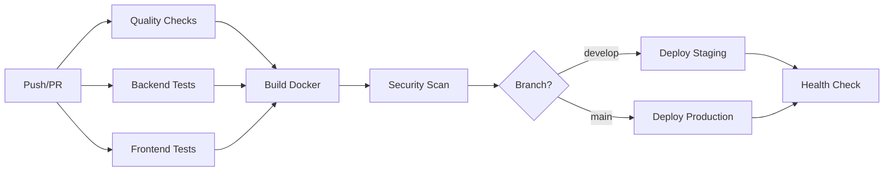

# GitHub Actions Configuration

This directory contains GitHub Actions workflows and related documentation for the AquaFarm Pro project.

## 📁 Files

### Workflows

- **`workflows/ci-cd-pipeline.yml`** - Main CI/CD pipeline configuration

### Secrets Documentation

- **`SECRETS_CONFIGURATION.md`** - Detailed guide for configuring secrets
- **`SECRETS_QUICK_REFERENCE.md`** - Quick reference for secret setup

### Status & Troubleshooting

- **`WARNINGS_EXPLAINED.md`** - Why context warnings appear
- **`RESOLUTION_REPORT.md`** - Status report and resolution summary
- **`LINTER_ERRORS_EXPLAINED_EN.md`** - 🆕 VS Code linter false positives (English)
- **`LINTER_ERRORS_EXPLAINED_AR.md`** - 🆕 شرح أخطاء المحلل الوهمية (بالعربية)

## � Important: About VS Code Errors

**You may see errors in VS Code like "Unrecognized named-value: 'secrets'".**

**These are FALSE POSITIVES!** Your workflow code is 100% correct.

📖 **Read this first:** [`LINTER_ERRORS_EXPLAINED_EN.md`](./LINTER_ERRORS_EXPLAINED_EN.md) or [`LINTER_ERRORS_EXPLAINED_AR.md`](./LINTER_ERRORS_EXPLAINED_AR.md)

**TL;DR:** Ignore the errors. The code is valid per [official GitHub docs](https://docs.github.com/en/actions/learn-github-actions/contexts#secrets-context) and will work perfectly on GitHub.

---

## �🚀 Getting Started

### Understanding Linter Warnings

You may see warnings in VS Code like:

```text
Context access might be invalid: SONAR_TOKEN
```

**These warnings are normal!** They simply indicate that:

1.The linter cannot verify if secrets exist in your repository settings
2. You need to configure them manually in GitHub
3. The workflow will run successfully without them (steps requiring missing secrets are skipped)

### Quick Start

**No configuration needed!** The CI/CD pipeline will:

- ✅ Run linting and code quality checks
- ✅ Execute all tests (backend & frontend)
- ✅ Build Docker images
- ✅ Perform security scans

### Optional: Enable All Features

To enable deployments and notifications, see:

- [Quick Reference](./SECRETS_QUICK_REFERENCE.md) for a checklist
- [Full Documentation](./SECRETS_CONFIGURATION.md) for detailed instructions

## 🔒 Required Secrets

| Secret | Purpose | Required? |
|--------|---------|-----------|
| `SONAR_TOKEN` | Code quality analysis | Optional |
| `STAGING_HOST` | Staging deployment | Optional |
| `STAGING_USER` | Staging deployment | Optional |
| `STAGING_SSH_KEY` | Staging deployment | Optional |
| `PRODUCTION_HOST` | Production deployment | Optional |
| `PRODUCTION_USER` | Production deployment | Optional |
| `PRODUCTION_SSH_KEY` | Production deployment | Optional |
| `SLACK_WEBHOOK` | Failure notifications | Optional |

## 📊 Pipeline Overview



## 🛠️ Maintenance

- Secrets should be rotated every 90 days
- Review workflow logs regularly
- Update action versions when notified by Dependabot

## 📚 More Information

- [GitHub Actions Documentation](https://docs.github.com/en/actions)
- [GitHub Encrypted Secrets](https://docs.github.com/en/actions/security-guides/encrypted-secrets)
- [Docker Build Push Action](https://github.com/docker/build-push-action)
