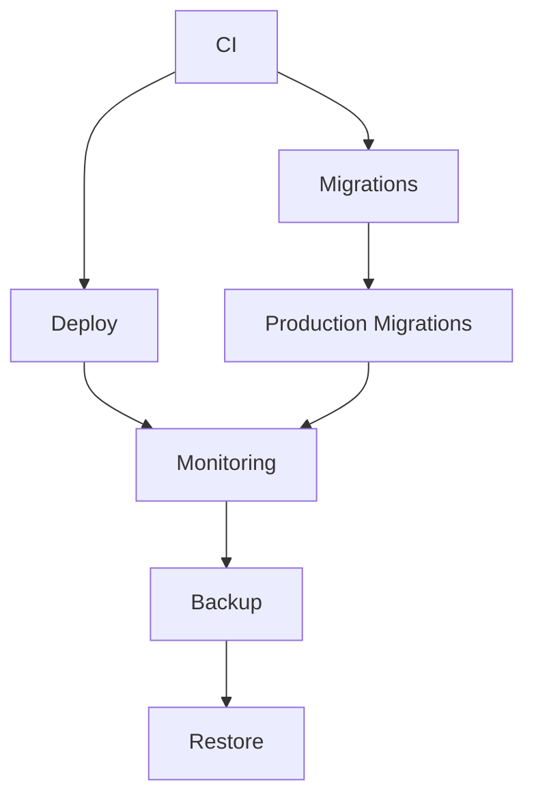

# GitHub Workflows Documentation

This directory contains all GitHub Actions workflows for the AquaFarm Pro project.

## Workflows Overview

### 1. CI (Continuous Integration)
**File:** `ci.yml`
**Trigger:** Pull requests, pushes to main/master, manual dispatch
**Purpose:** Run tests, linting, and build checks

**Jobs:**
- `backend`: Lint, test, and build backend
- `frontend`: Lint and build frontend
- `mobile`: Lint and type check mobile app
- `migrations`: Run database migrations on staging
- `build-test`: Matrix testing with SQLite and PostgreSQL

### 2. Deploy
**File:** `deploy.yml`
**Trigger:** Manual dispatch only
**Purpose:** Deploy to staging or production environments

**Features:**
- Environment selection (staging/production)
- Optional test skipping
- Database migrations
- Health checks
- Deployment notifications

### 3. Production Database Migrations
**File:** `production-migrations.yml`
**Trigger:** Manual dispatch only
**Purpose:** Run database migrations on production

**Features:**
- Production confirmation required
- Dry run option
- RLS policy verification
- Migration validation

### 4. Security Scan
**File:** `security-scan.yml`
**Trigger:** Weekly schedule, manual dispatch, pushes to main
**Purpose:** Comprehensive security scanning

**Scans:**
- Dependency vulnerabilities
- Code security issues
- Docker image vulnerabilities
- Infrastructure security
- Hardcoded secrets detection

### 5. Performance Testing
**File:** `performance-test.yml`
**Trigger:** Weekly schedule, manual dispatch
**Purpose:** Load and performance testing

**Features:**
- k6 performance testing
- Multiple test types (load, stress, spike, volume)
- Configurable duration
- Performance reporting

### 6. Automated Backup
**File:** `backup.yml`
**Trigger:** Daily schedule, manual dispatch
**Purpose:** Automated backup of database and files

**Features:**
- Database backup with pg_dump
- Files backup from object storage
- S3 upload and retention
- Backup verification
- Cleanup of old backups

### 7. Restore from Backup
**File:** `restore.yml`
**Trigger:** Manual dispatch only
**Purpose:** Restore from backup

**Features:**
- Date-based backup selection
- Full or partial restore
- Environment selection
- Confirmation required
- Restore verification

### 8. Monitoring and Health Checks
**File:** `monitoring.yml`
**Trigger:** Every 5 minutes, manual dispatch
**Purpose:** Continuous monitoring

**Checks:**
- API health
- Database connectivity
- Redis connectivity
- Object storage health
- Performance metrics
- Active alerts

### 9. Environment Validation
**File:** `validate-environments.yml`
**Trigger:** Manual dispatch only
**Purpose:** Validate environment configurations

**Features:**
- Environment selection
- Secret validation
- Connection testing
- Configuration verification

## Environment Setup

### Required Environments
1. **staging**: No protection rules
2. **production**: Required reviewers (1) + 5-minute wait timer

### Required Secrets

#### Repository Secrets (Shared)
- `REDIS_URL`
- `OBJECT_STORAGE_*`
- `JWT_SECRET`
- `ENCRYPTION_KEY`
- `SMTP_*`
- `PROMETHEUS_ENDPOINT`
- `GRAFANA_API_KEY`

#### Environment-Specific Secrets

**Staging:**
- `STAGING_DATABASE_URL`
- `STRIPE_SECRET_KEY` (test)
- `STRIPE_PUBLISHABLE_KEY` (test)

**Production:**
- `PROD_DATABASE_URL`
- `STRIPE_SECRET_KEY` (live)
- `STRIPE_PUBLISHABLE_KEY` (live)
- `STRIPE_WEBHOOK_SECRET`

## Workflow Dependencies



## Security Considerations

### Environment Protection
- Production environment requires reviewer approval
- Sensitive operations require confirmation
- Secrets are environment-specific where appropriate

### Access Control
- Database URLs are environment-specific
- Stripe keys are environment-specific (test vs live)
- All secrets are encrypted at rest

### Audit Trail
- All workflow runs are logged
- Environment changes are tracked
- Deployment history is maintained

## Troubleshooting

### Common Issues

1. **Environment not found**
   - Ensure environments are created in GitHub
   - Check environment names match exactly

2. **Secrets not accessible**
   - Verify secrets are set in correct environment
   - Check repository vs environment secrets

3. **Database connection failed**
   - Verify DATABASE_URL format
   - Check database credentials
   - Ensure database is accessible

4. **Stripe webhook failed**
   - Check STRIPE_WEBHOOK_SECRET
   - Verify webhook endpoint configuration

### Validation Commands

```bash
# Test database connection
npm run migration:run

# Test Stripe connection
npm run test:stripe

# Test Redis connection
npm run test:redis

# Run security scan
npm run security:scan

# Run performance test
npm run performance:test
```

## Monitoring and Alerts

### Health Check Endpoints
- Staging: `https://staging.aquafarm.cloud/health`
- Production: `https://api.aquafarm.cloud/health`
- Metrics: `https://api.aquafarm.cloud/_metrics`

### Alert Conditions
- API response time > 1s
- Database connection failure
- Redis connection failure
- Storage access failure
- Critical alerts > 0

### Notification Channels
- Slack notifications
- Email alerts
- GitHub notifications
- Custom webhooks

## Best Practices

### Development
1. Always run CI before merging
2. Test migrations on staging first
3. Use dry run for production migrations
4. Monitor performance after deployment

### Security
1. Regular security scans
2. Keep dependencies updated
3. Use environment-specific secrets
4. Implement proper access controls

### Operations
1. Regular backups
2. Monitor system health
3. Test restore procedures
4. Document changes

## Support

For issues with workflows:
1. Check workflow logs in GitHub Actions
2. Verify environment and secret configuration
3. Test individual components
4. Contact DevOps team for assistance
