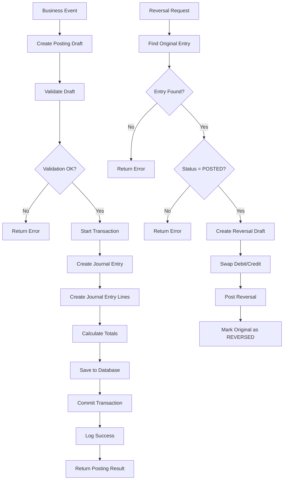

# Accounting Posting Engine Flow

## Overview

The AquaFarm Pro accounting system implements a double-entry bookkeeping system with a comprehensive posting engine that handles journal entries, account balances, and transaction reversals.

## Architecture

```
┌─────────────────┐    ┌─────────────────┐    ┌─────────────────┐
│   Business      │    │   Posting       │    │   Chart of     │
│   Events        │───▶│   Engine        │───▶│   Accounts     │
└─────────────────┘    └─────────────────┘    └─────────────────┘
         │                       │                       │
         ▼                       ▼                       ▼
┌─────────────────┐    ┌─────────────────┐    ┌─────────────────┐
│   Journal       │    │   Journal       │    │   Account       │
│   Entries       │    │   Entry Lines   │    │   Balances      │
└─────────────────┘    └─────────────────┘    └─────────────────┘
```

## Posting Flow Diagram



## Core Components

### 1. Chart of Accounts

**Structure:**
- Hierarchical account organization
- 5 main account types: ASSET, LIABILITY, EQUITY, REVENUE, EXPENSE
- Multi-level account codes (1000, 1100, 1110, etc.)
- Tenant-specific account isolation

**Default Accounts:**
```
1000 - ASSETS
├── 1100 - CURRENT ASSETS
│   ├── 1110 - Cash and Cash Equivalents
│   ├── 1120 - Accounts Receivable
│   ├── 1130 - Inventory
│   └── 1140 - Prepaid Expenses
├── 1200 - FIXED ASSETS
│   ├── 1210 - Land and Buildings
│   ├── 1220 - Equipment
│   └── 1230 - Vehicles

2000 - LIABILITIES
├── 2100 - CURRENT LIABILITIES
│   ├── 2110 - Accounts Payable
│   ├── 2120 - Accrued Expenses
│   └── 2140 - Tax Payable
└── 2200 - LONG-TERM LIABILITIES

3000 - EQUITY
├── 3100 - Share Capital
└── 3200 - Retained Earnings

4000 - REVENUE
├── 4100 - Sales Revenue
│   ├── 4110 - Fish Sales
│   └── 4120 - Feed Sales
└── 4200 - Other Revenue

5000 - EXPENSES
├── 5100 - COST OF GOODS SOLD
│   ├── 5110 - Feed Costs
│   ├── 5120 - Fingerling Costs
│   └── 5130 - Labor Costs
├── 5200 - OPERATING EXPENSES
│   ├── 5210 - Salaries and Wages
│   ├── 5220 - Utilities
│   └── 5230 - Maintenance
└── 5300 - DEPRECIATION
```

### 2. Journal Entries

**Structure:**
- Header: Reference, description, transaction date, currency
- Lines: Account, debit amount, credit amount, description
- Status: DRAFT, POSTED, REVERSED
- Metadata: Additional business context

**Example Entry:**
```json
{
  "reference": "INV-001",
  "description": "Fish sale to customer",
  "transactionDate": "2024-01-15",
  "currency": "USD",
  "lines": [
    {
      "accountCode": "1120",
      "debit": 1000.00,
      "credit": 0.00,
      "description": "Accounts Receivable"
    },
    {
      "accountCode": "4110",
      "debit": 0.00,
      "credit": 1000.00,
      "description": "Fish Sales Revenue"
    }
  ]
}
```

### 3. Posting Engine

**Validation Rules:**
1. At least 2 lines required (double-entry)
2. Total debits = Total credits (balanced)
3. All account codes must exist
4. All amounts must be positive

**Posting Process:**
1. Validate draft structure and balances
2. Verify all account codes exist
3. Start database transaction
4. Create journal entry header
5. Create journal entry lines
6. Calculate and store totals
7. Commit transaction
8. Log success

### 4. Account Balances

**Balance Calculation:**
- **Assets & Expenses**: Balance = Debits - Credits (normal debit balance)
- **Liabilities, Equity & Revenue**: Balance = Credits - Debits (normal credit balance)

**Example:**
```typescript
// Cash account (Asset)
const cashBalance = await postingEngine.getAccountBalance('1110', tenantId);
// Returns: { accountCode: '1110', debitTotal: 5000, creditTotal: 2000, balance: 3000 }

// Sales Revenue account (Revenue)
const salesBalance = await postingEngine.getAccountBalance('4110', tenantId);
// Returns: { accountCode: '4110', debitTotal: 0, creditTotal: 10000, balance: 10000 }
```

## Business Event Examples

### 1. Fish Sale
```typescript
const fishSaleDraft: PostingDraft = {
  reference: 'SALE-001',
  description: 'Fish sale to customer',
  transactionDate: '2024-01-15',
  lines: [
    { accountCode: '1120', debit: 1000, credit: 0, description: 'Accounts Receivable' },
    { accountCode: '4110', debit: 0, credit: 1000, description: 'Fish Sales Revenue' }
  ]
};
```

### 2. Feed Purchase
```typescript
const feedPurchaseDraft: PostingDraft = {
  reference: 'PURCH-001',
  description: 'Feed purchase from supplier',
  transactionDate: '2024-01-15',
  lines: [
    { accountCode: '5110', debit: 500, credit: 0, description: 'Feed Costs' },
    { accountCode: '2110', debit: 0, credit: 500, description: 'Accounts Payable' }
  ]
};
```

### 3. Cash Payment
```typescript
const cashPaymentDraft: PostingDraft = {
  reference: 'PAY-001',
  description: 'Cash payment to supplier',
  transactionDate: '2024-01-16',
  lines: [
    { accountCode: '2110', debit: 500, credit: 0, description: 'Accounts Payable' },
    { accountCode: '1110', debit: 0, credit: 500, description: 'Cash' }
  ]
};
```

### 4. Equipment Purchase
```typescript
const equipmentPurchaseDraft: PostingDraft = {
  reference: 'EQ-001',
  description: 'Equipment purchase',
  transactionDate: '2024-01-15',
  lines: [
    { accountCode: '1220', debit: 5000, credit: 0, description: 'Equipment' },
    { accountCode: '1110', debit: 0, credit: 5000, description: 'Cash' }
  ]
};
```

## Error Handling

### Validation Errors
- **Insufficient Lines**: "At least two lines required (double-entry)"
- **Unbalanced Entry**: "Debits and credits must balance"
- **Invalid Account**: "Account codes not found: 9999, 8888"
- **Negative Amounts**: "All amounts must be positive"

### Business Logic Errors
- **Entry Not Found**: "Journal entry not found"
- **Invalid Status**: "Only posted entries can be reversed"
- **Account Not Found**: "Account not found"

## Reversal Process

### 1. Automatic Reversal
```typescript
const reversalResult = await postingEngine.reverse(
  'journal-entry-id',
  'Customer returned fish'
);
```

### 2. Reversal Logic
1. Find original journal entry
2. Verify entry is POSTED status
3. Create reversal draft with swapped debits/credits
4. Post reversal entry
5. Mark original as REVERSED
6. Link entries via metadata

### 3. Reversal Example
```typescript
// Original Entry
{
  "reference": "SALE-001",
  "lines": [
    { accountCode: "1120", debit: 1000, credit: 0 },
    { accountCode: "4110", debit: 0, credit: 1000 }
  ]
}

// Reversal Entry
{
  "reference": "REV-SALE-001",
  "lines": [
    { accountCode: "1120", debit: 0, credit: 1000 },
    { accountCode: "4110", debit: 1000, credit: 0 }
  ]
}
```

## Multi-Currency Support

### Currency Handling
- Default currency: USD
- Support for multiple currencies per entry
- Exchange rate tracking (future enhancement)
- Currency-specific reporting

### Example
```typescript
const multiCurrencyDraft: PostingDraft = {
  reference: 'INTL-001',
  description: 'International sale',
  currency: 'EUR',
  lines: [
    { accountCode: '1120', debit: 1000, credit: 0 },
    { accountCode: '4110', debit: 0, credit: 1000 }
  ]
};
```

## Reporting and Analytics

### Account Balance Reports
```typescript
// Get balance for specific account
const balance = await postingEngine.getAccountBalance('1110', tenantId);

// Get balance as of specific date
const historicalBalance = await postingEngine.getAccountBalance(
  '1110', 
  tenantId, 
  '2024-01-01'
);
```

### Trial Balance
```typescript
// Get all account balances
const trialBalance = await chartOfAccountsRepo
  .createQueryBuilder('account')
  .leftJoinAndSelect('account.lines', 'lines')
  .leftJoinAndSelect('lines.journalEntry', 'entry')
  .where('account.tenantId = :tenantId', { tenantId })
  .andWhere('entry.status = :status', { status: 'POSTED' })
  .getMany();
```

## Security and Compliance

### Tenant Isolation
- All entries scoped by tenant
- Account codes unique per tenant
- Cross-tenant access prevention

### Audit Trail
- All entries logged with timestamps
- User tracking for created entries
- Metadata for business context
- Reversal tracking

### Data Integrity
- Database transactions ensure consistency
- Foreign key constraints
- Balance validation
- Status management

## Performance Considerations

### Indexing Strategy
- Tenant + reference index
- Account code index
- Transaction date index
- Status index

### Query Optimization
- Efficient balance calculations
- Paginated entry listing
- Cached account lookups
- Optimized reporting queries

## Future Enhancements

### Planned Features
1. **Multi-Currency**: Exchange rate management
2. **Recurring Entries**: Automated posting
3. **Budget Integration**: Variance analysis
4. **Tax Integration**: Automatic tax calculations
5. **Reporting Engine**: Advanced financial reports
6. **API Integration**: External system connectivity

### Scalability
- Horizontal scaling support
- Database partitioning
- Caching strategies
- Performance monitoring
